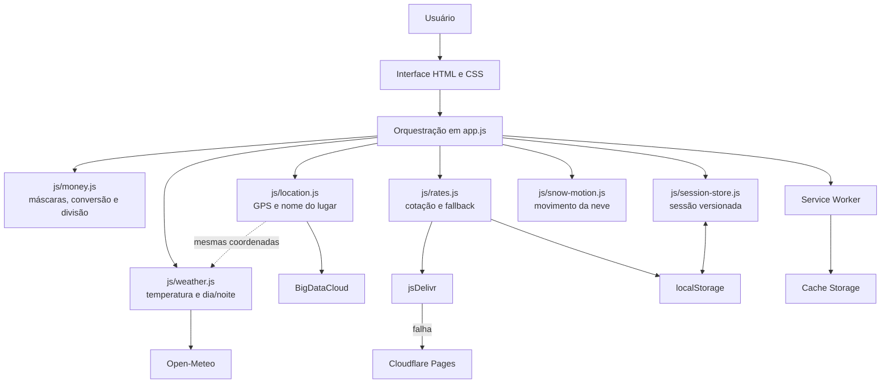

# Bordo — Conta de Viagem


**Converta. Some. Divida.**

O **Bordo** é um Progressive Web App para viagens entre Brasil e Chile. Ele converte peso chileno (CLP) e real brasileiro (BRL), acompanha localização e temperatura, organiza gastos, divide a conta e compartilha o resumo final — sem cadastro, anúncios ou backend.

URL preparada para publicação: [rgjuni0r.github.io/conversor-clp-brl](https://rgjuni0r.github.io/conversor-clp-brl/)

## Sumário

- [Visão geral](#visão-geral)
- [Funcionalidades](#funcionalidades)
- [Localização e clima](#localização-e-clima)
- [Arquitetura](#arquitetura)
- [Conversão e precisão](#conversão-e-precisão)
- [Estrutura do projeto](#estrutura-do-projeto)
- [Execução local](#execução-local)
- [Testes](#testes)
- [Instalação como aplicativo](#instalação-como-aplicativo)
- [Publicação e SEO](#publicação-e-seo)
- [Configuração e manutenção](#configuração-e-manutenção)
- [Privacidade e segurança](#privacidade-e-segurança)
- [Limitações conhecidas](#limitações-conhecidas)
- [Roadmap](#roadmap)

## Visão geral

O Bordo foi pensado como um companheiro para toda a conta da viagem. Cada conversão pode virar um gasto; cada gasto preserva a cotação utilizada; e o resumo apresenta totais em CLP e BRL, além de uma divisão exata entre até 99 pessoas.

A sessão fica salva no próprio aparelho. Depois do primeiro carregamento bem-sucedido, o shell do PWA, a última cotação válida e a conta continuam disponíveis quando a conexão estiver instável ou ausente.

### Princípios do produto

- Ser rápido e confortável de usar no celular.
- Reunir conversão, gastos, divisão, localização e clima em um único fluxo.
- Preservar a cotação de cada item para manter a conta auditável.
- Evitar erros acumulados de ponto flutuante em valores monetários.
- Continuar útil com conexão limitada.
- Solicitar localização e movimento somente a partir de uma ação do usuário.
- Funcionar sem framework, etapa de build ou dependências em produção.

## Funcionalidades

### Câmbio

- Conversão de CLP para BRL e de BRL para CLP.
- Máscaras monetárias adequadas às duas moedas.
- Referência cambial diária, com data de origem validada.
- Fonte principal e espelho independente de contingência.
- Persistência da última cotação válida no navegador.
- Atualização ao abrir, retornar ao app, recuperar a conexão e a cada hora enquanto a página estiver visível.
- Ajuste manual da taxa de conversão.

### Conta de viagem

- Inclusão de conversões no resumo com descrição opcional.
- Edição de descrição e valor sem alterar a cotação originalmente registrada.
- Soma dos gastos em CLP e BRL usando unidades monetárias inteiras.
- Exclusão individual, limpeza completa e confirmações personalizadas.
- Divisão entre 1 e 99 pessoas, incluindo o tratamento do resíduo de arredondamento.
- Recibo final com total, quantidade de pessoas e valor individual.
- Compartilhamento nativo no celular, com cópia para a área de transferência como alternativa.
- Contexto único de lugar para toda a conta.

### Localização e clima

- Santiago, Chile, como referência climática inicial, sem solicitar GPS ao abrir.
- Localidade, cidade e país obtidos após toque no botão de localização.
- Temperatura atual em graus Celsius para as mesmas coordenadas.
- Ícone de sol dourado durante o dia e lua azul-prateada durante a noite.
- Atualização do clima a cada 10 minutos enquanto a página estiver visível.
- Nova consulta ao abrir, voltar para a tela ou recuperar a conexão.

### PWA e experiência mobile

- Instalação no iPhone, Android e navegadores compatíveis.
- Cache do shell para funcionamento offline após o primeiro acesso.
- Persistência automática da conta no `localStorage`.
- Layout responsivo com suporte às áreas seguras do iPhone.
- Resumo em accordion no mobile e visualização completa no desktop.
- Identidade inspirada nos Andes, com neve animada em profundidade.
- Efeito de globo de neve por agitação intencional, com respeito a `prefers-reduced-motion`.
- Marca visual própria com avião, trajetória e ponto de destino.

## Localização e clima

Sem permissão de localização, o Bordo mostra **Santiago, Chile** e consulta a temperatura atual em Celsius para as coordenadas da cidade.

Ao tocar no alvo e autorizar o GPS:

1. O navegador fornece as coordenadas atuais.
2. A BigDataCloud identifica localidade, cidade e país.
3. A Open-Meteo consulta temperatura e período do dia para as mesmas coordenadas.
4. O texto, a temperatura, o ícone e sua cor são atualizados juntos.

As coordenadas exatas não são persistidas. Somente o nome do lugar entra na sessão local. Por isso, depois de recarregar o app, o clima volta para Santiago até que a localização seja acionada novamente.

Digitar um lugar manualmente define o contexto da conta, mas não altera as coordenadas usadas pelo clima. Uma nova leitura meteorológica também exige conexão.

## Arquitetura

O Bordo é uma aplicação estática e client-side. Interface, cálculos, persistência e chamadas às APIs são executados diretamente no navegador.



### Componentes

| Componente | Responsabilidade |
| --- | --- |
| `index.html` | HTML semântico, interface, SEO, Open Graph e dados estruturados. |
| `style.css` | Design responsivo, componentes, animações e safe areas. |
| `app.js` | Estado da interface, eventos, recibo, localização e compartilhamento. |
| `js/money.js` | Máscaras, formatação, conversão e divisão com unidades inteiras. |
| `js/location.js` | Validação de coordenadas e geocodificação reversa. |
| `js/weather.js` | Temperatura atual, referência de Santiago e período de dia/noite. |
| `js/rates.js` | Cotação cambial, timeout, validação e contingência. |
| `js/session-store.js` | Modelo, validação e persistência da conta. |
| `js/snow-motion.js` | Shake, progressão, turbulência e cooldown da neve. |
| `sw.js` | Cache versionado e fallback offline. |
| `manifest.json` | Identidade, instalação e ícones do PWA. |
| `robots.txt` e `sitemap.xml` | Descoberta e orientação para mecanismos de busca. |
| `tests/` | Testes automatizados dos módulos de domínio. |

### Serviços externos

| Serviço | Uso | Frequência |
| --- | --- | --- |
| [Currency API](https://github.com/fawazahmed0/exchange-api) | Taxa diária CLP → BRL via jsDelivr e espelho Cloudflare. | A cada hora no app; a fonte publica referência diária. |
| [BigDataCloud](https://www.bigdatacloud.com/free-api/free-reverse-geocode-to-city-api) | Converte as coordenadas em nome de lugar. | Somente após ação explícita de localização. |
| [Open-Meteo](https://open-meteo.com/en/docs) | Temperatura atual e indicador de dia/noite. | A cada 10 minutos enquanto a página está visível. |

Nenhuma dessas integrações usa uma chave privada dentro do projeto.

## Conversão e precisão

A variável central representa quantos reais valem `1 CLP`.

```text
BRL = CLP × taxa CLP/BRL
CLP = BRL ÷ taxa CLP/BRL
```

Exemplo com taxa hipotética de `0,0055`:

```text
8.500 CLP × 0,0055 = 46,75 BRL
100 BRL ÷ 0,0055 = 18.181,81 CLP
```

Valores em reais são armazenados em centavos inteiros e valores em pesos em unidades inteiras. A conversão usa frações decimais com `BigInt` e arredonda uma única vez para a menor unidade exibida.

Cada item congela sua taxa, origem e data de referência. Atualizações posteriores afetam somente novas conversões.

Quando o total não é divisível igualmente, o Bordo informa quem absorve a unidade restante. Por exemplo, `R$ 100,00 ÷ 3` produz uma parcela de `R$ 33,34` e duas de `R$ 33,33`.

> A cotação é uma referência. Bancos, cartões e casas de câmbio podem incluir spread, tributos, tarifas e diferenças entre compra e venda.

## Estrutura do projeto

```text
conversor-clp-brl/
├── js/
│   ├── location.js
│   ├── money.js
│   ├── rates.js
│   ├── session-store.js
│   ├── snow-motion.js
│   └── weather.js
├── tests/
│   ├── location.test.js
│   ├── money.test.js
│   ├── rates.test.js
│   ├── session-store.test.js
│   ├── snow-motion.test.js
│   └── weather.test.js
├── app.js
├── index.html
├── style.css
├── sw.js
├── manifest.json
├── robots.txt
├── sitemap.xml
├── favicon.ico
├── favicon-16.png
├── favicon-32.png
├── favicon-48.png
├── icon-180.png
├── icon-192.png
├── icon-512.png
├── icon-maskable-192.png
├── icon-maskable-512.png
├── icon-1024.png
├── og-image.png
├── package.json
└── README.md
```

## Execução local

### Pré-requisitos

- Navegador moderno.
- Python 3 ou outro servidor HTTP estático.
- Node.js 20 ou superior apenas para executar os testes.

Não abra o `index.html` por `file://`: Service Workers e geolocalização exigem `localhost` ou HTTPS.

```bash
python3 -m http.server 8080
```

Depois, abra `http://localhost:8080`.

## Testes

O projeto utiliza o test runner nativo do Node.js e não possui dependências npm.

```bash
npm test
```

A suíte cobre:

- máscaras, parsing e conversão CLP/BRL;
- arredondamento e divisão de unidades monetárias;
- criação, edição, validação e persistência de sessões;
- fonte cambial principal, fallback e datas de referência;
- coordenadas, geocodificação e mensagens de erro;
- consulta, validação e formatação do clima;
- alternância entre ícones de dia e noite;
- shake, cooldown, inversões e turbulência da neve.

## Instalação como aplicativo

### iPhone e iPad

1. Abra a versão HTTPS no Safari.
2. Toque em **Compartilhar**.
3. Escolha **Adicionar à Tela de Início**.
4. Confirme em **Adicionar**.

### Android

1. Abra a versão HTTPS no Chrome.
2. Abra o menu do navegador.
3. Escolha **Instalar app** ou **Adicionar à tela inicial**.

O manifesto inclui ícones comuns, Apple Touch Icon e um ícone `maskable` para recortes adaptativos do Android.

## Publicação e SEO

### URL canônica configurada

```text
https://rgjuni0r.github.io/conversor-clp-brl/
```

O projeto contém:

- título e descrição próprios;
- canonical absoluto e autorreferente;
- diretivas de indexação com prévia grande de imagem;
- Open Graph e Twitter Card;
- cartão social de `1200 × 630`;
- JSON-LD com `Organization`, `WebSite` e `WebApplication`;
- manifesto PWA com nome, categorias e ícone maskable;
- favicon ICO com 16, 32 e 48 pixels, além dos PNGs;
- `sitemap.xml` com a URL canônica;
- `robots.txt` preparado para uma publicação na raiz do domínio.

Esses recursos tornam o site rastreável e ajudam o Google a entender sua finalidade, mas **não garantem indexação nem posição nos resultados**.

### Publicar no GitHub Pages

1. Envie as alterações para a branch `main`.
2. Em **Settings → Pages**, escolha **Deploy from a branch**.
3. Selecione `main` e a pasta `/root`.
4. Aguarde a publicação e teste a URL canônica.

### Solicitar indexação no Google

1. Crie no [Google Search Console](https://search.google.com/search-console/) uma propriedade de prefixo para a URL canônica.
2. Use **Inspeção de URL → Testar URL publicada**.
3. Solicite a indexação da página inicial.
4. Envie `https://rgjuni0r.github.io/conversor-clp-brl/sitemap.xml` na área **Sitemaps**.
5. Valide o JSON-LD no [Rich Results Test](https://search.google.com/test/rich-results).
6. Monitore cobertura, canonical selecionado, experiência mobile e Core Web Vitals.

O projeto não inventa avaliações ou notas. Sem avaliações reais, o markup de aplicativo pode não se qualificar para um rich result específico, mas continua descrevendo a aplicação de forma estruturada.

### Limitação do subdiretório no GitHub Pages

O Google trata nome do site, favicon de resultado e `robots.txt` no nível do **hostname**, não do subdiretório. Portanto:

- o favicon do Bordo funciona normalmente no navegador e no PWA;
- `rgjuni0r.github.io/conversor-clp-brl/robots.txt` não substitui `rgjuni0r.github.io/robots.txt`;
- o favicon mostrado na Busca pode ser o favicon geral de `rgjuni0r.github.io`;
- para uma identidade isolada e consistente, prefira um domínio ou subdomínio próprio.

Ao adotar um domínio próprio, atualize juntos:

- `canonical`;
- `og:url` e URLs absolutas das imagens;
- URLs e identificadores do JSON-LD;
- `<loc>` do sitemap;
- linha `Sitemap` do `robots.txt`;
- propriedade do Search Console.

Não foi incluída a meta tag `keywords`: o Google a ignora. Os termos relevantes aparecem naturalmente no título, na descrição e no conteúdo visível.

## Configuração e manutenção

### Constantes principais

| Constante | Arquivo | Finalidade |
| --- | --- | --- |
| `PRIMARY_RATE_API_URL` | `js/rates.js` | Cotação cambial principal. |
| `FALLBACK_RATE_API_URL` | `js/rates.js` | Espelho de contingência. |
| `RATE_REFRESH_INTERVAL_MS` | `js/rates.js` | Atualização cambial a cada hora. |
| `REVERSE_GEOCODING_ENDPOINT` | `js/location.js` | Nome do lugar pelas coordenadas. |
| `WEATHER_ENDPOINT` | `js/weather.js` | Temperatura e período do dia. |
| `WEATHER_REFRESH_INTERVAL_MS` | `js/weather.js` | Atualização climática a cada 10 minutos. |
| `SANTIAGO_COORDINATES` | `js/weather.js` | Referência climática inicial. |

### Dados persistidos

| Chave | Conteúdo |
| --- | --- |
| `clpBrlRateV2` | Última taxa válida, origem e data de referência. |
| `clpBrlSessionV1` | Lugar, itens, pessoas, taxas registradas e status da conta. |
| `clpBrlMotionPermissionV1` | Preferência local do efeito por movimento. |

As chaves antigas foram preservadas após o rebranding para não apagar contas existentes.

### Cache do PWA

Ao alterar HTML, CSS, JavaScript, manifesto ou ícones:

1. Incremente a versão atual de `CACHE` em `sw.js`.
2. Atualize os parâmetros de versão de `style.css` e `app.js` no HTML e na lista `ASSETS`.
3. Confirme que todos os caminhos de `ASSETS` existem.
4. Teste uma atualização partindo de uma versão já instalada.

O prefixo histórico `clp-brl-` deve permanecer, ou a rotina de ativação precisa remover explicitamente caches antigos desse prefixo.

### Checklist antes de publicar

- Executar `npm test`.
- Validar conversões e máscaras nos dois sentidos.
- Adicionar, editar, remover e dividir gastos.
- Fechar, compartilhar e reabrir a conta.
- Testar localização concedida, negada e indisponível.
- Confirmar temperatura, cidade/país e ícone de dia/noite.
- Verificar o carregamento offline após o primeiro acesso.
- Instalar o PWA e conferir ícones normal e maskable.
- Verificar canonical, Open Graph, JSON-LD, sitemap e robots.
- Confirmar a nova versão do cache.

## Privacidade e segurança

- Não há cadastro, cookies próprios, analytics ou backend.
- Valores, itens e divisão permanecem no navegador.
- A temperatura padrão de Santiago é consultada sem solicitar localização.
- Após autorização do GPS, as coordenadas são enviadas diretamente à BigDataCloud e à Open-Meteo.
- Coordenadas exatas não são persistidas pelo Bordo.
- Dados de movimento são processados apenas em memória.
- Consultas cambiais vão diretamente às fontes documentadas.
- Não existem segredos ou chaves privadas no JavaScript.
- A produção deve usar exclusivamente HTTPS.

Qualquer segredo adicionado ao JavaScript client-side ficaria público. Uma futura API privada deve passar por backend ou função serverless.

## Limitações conhecidas

- A referência cambial é diária e pode não refletir oscilações intradiárias.
- Feriados e fins de semana podem manter a última taxa publicada.
- A cotação comercial não inclui automaticamente spread, tarifas ou tributos.
- O modo offline depende de um primeiro acesso bem-sucedido.
- Uma atualização nova de temperatura exige conexão.
- Um lugar digitado manualmente não altera o clima.
- O clima volta para Santiago após recarregar, pois as coordenadas não são persistidas.
- Itens registrados nunca são recalculados silenciosamente.
- O efeito de shake depende de suporte e permissão do dispositivo.
- A aplicação ainda não possui histórico ou gráfico cambial.

## Roadmap

- [ ] Sincronizar o clima com uma cidade digitada manualmente por geocodificação direta.
- [ ] Permitir configurar spread, impostos e tarifas.
- [ ] Mostrar a taxa inversa (`1 BRL = X CLP`).
- [ ] Criar histórico local de cotações.
- [ ] Exportar o recibo como imagem ou PDF.
- [ ] Adicionar suporte configurável a outros países e moedas.
- [ ] Automatizar testes e publicação com GitHub Actions.
- [ ] Adotar domínio próprio e concluir a configuração no Search Console.

## Direitos autorais

Desenvolvido por [abc Ensina](https://abcensina.com.br/).

Copyright © 2026 abc Ensina. Todos os direitos reservados.

Este projeto não possui licença de código aberto. Nenhuma permissão de uso, cópia, modificação, distribuição ou comercialização é concedida sem autorização expressa do titular dos direitos.
