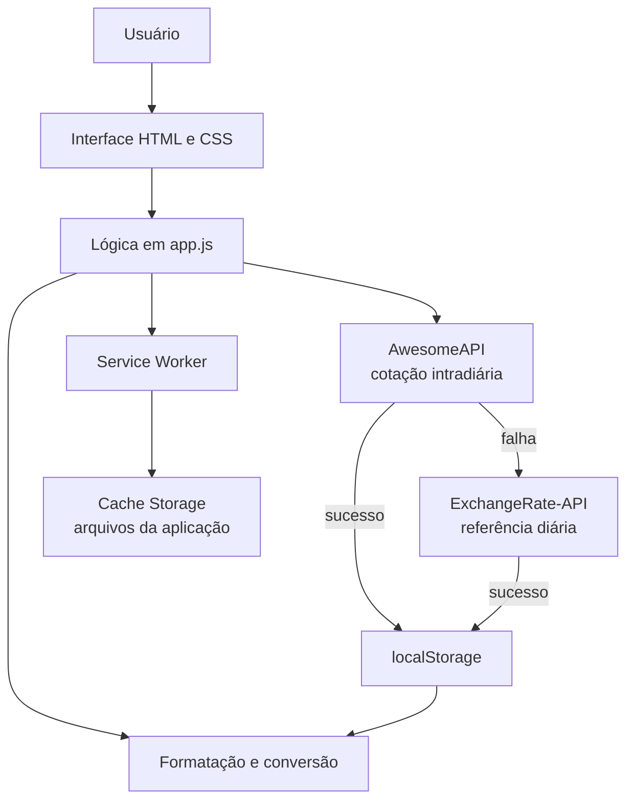

# Conversor CLP ⇄ BRL

Progressive Web App para conversão entre peso chileno (CLP) e real brasileiro (BRL), com cotação de mercado, funcionamento offline e instalação em dispositivos móveis.

O projeto foi desenvolvido em HTML, CSS e JavaScript puro. Não exige framework, etapa de build ou instalação de dependências.

## Sumário

- [Visão geral](#visão-geral)
- [Funcionalidades](#funcionalidades)
- [Arquitetura](#arquitetura)
- [Regras de conversão](#regras-de-conversão)
- [Fontes de cotação](#fontes-de-cotação)
- [Estrutura do projeto](#estrutura-do-projeto)
- [Execução local](#execução-local)
- [Instalação como aplicativo](#instalação-como-aplicativo)
- [Publicação no GitHub Pages](#publicação-no-github-pages)
- [Configuração e manutenção](#configuração-e-manutenção)
- [Privacidade e segurança](#privacidade-e-segurança)
- [Limitações conhecidas](#limitações-conhecidas)
- [Roadmap](#roadmap)
- [Direitos autorais](#direitos-autorais)

## Visão geral

O Conversor CLP ⇄ BRL foi projetado para consultas rápidas durante viagens ao Chile ou ao Brasil. A aplicação formata os valores conforme cada moeda, atualiza a taxa enquanto está em uso e preserva a última cotação válida para situações sem conexão.

### Objetivos

- Oferecer conversão simples nos dois sentidos.
- Manter a interface adequada para uso em celulares.
- Trabalhar com uma referência cambial recente e identificável.
- Continuar disponível quando a conexão estiver instável ou ausente.
- Evitar dependências e infraestrutura desnecessárias.

## Funcionalidades

- Conversão de CLP para BRL e de BRL para CLP.
- Máscara monetária durante a digitação:
  - CLP: `8.500`.
  - BRL: `1.234,56`.
- Atualização automática ao abrir ou retornar ao aplicativo.
- Nova consulta a cada minuto enquanto a página estiver visível.
- Cotação intradiária baseada na média entre compra e venda.
- Fonte diária de contingência quando a fonte principal não responde.
- Persistência da última cotação válida no navegador.
- Ajuste manual da taxa de conversão.
- Cache do shell da aplicação para uso offline.
- Instalação como PWA no iPhone, Android e navegadores compatíveis.
- Layout responsivo com suporte às áreas seguras do iPhone.

## Arquitetura

A aplicação utiliza uma arquitetura client-side estática. Toda a interface, conversão, persistência e comunicação com as APIs são executadas diretamente no navegador.



### Componentes

| Componente | Responsabilidade |
| --- | --- |
| `index.html` | Estrutura semântica, campos, controles, metadados do PWA e rodapé. |
| `style.css` | Design responsivo, tema, máscaras visuais e safe areas. |
| `app.js` | Estado da aplicação, máscaras, fórmulas, APIs, fallback e persistência. |
| `sw.js` | Cache dos arquivos locais e funcionamento offline do shell. |
| `manifest.json` | Nome, ícones, cores e comportamento de instalação do PWA. |
| `localStorage` | Última taxa válida, origem e horário de referência. |

### Estratégia de resiliência

1. A aplicação solicita a cotação intradiária CLP/BRL.
2. Quando compra e venda estão disponíveis, utiliza a média entre elas.
3. Se a fonte principal falhar, consulta a fonte diária de contingência.
4. Se as duas consultas falharem, mantém a última taxa salva no dispositivo.
5. Se não existir uma taxa salva, utiliza apenas a referência inicial incorporada ao aplicativo e informa que não foi possível atualizar.

O timeout de cada consulta é de 10 segundos. As tentativas automáticas próximas são limitadas para evitar requisições duplicadas, e a contingência diária não é consultada repetidamente a cada minuto.

## Regras de conversão

A variável central da aplicação representa quantos reais valem `1 CLP`.

### Peso chileno para real

```text
valor em BRL = valor em CLP × taxa CLP/BRL
```

Exemplo com taxa hipotética de `0,0055`:

```text
8.500 CLP × 0,0055 = 46,75 BRL
```

### Real para peso chileno

```text
valor em CLP = valor em BRL ÷ taxa CLP/BRL
```

Exemplo com a mesma taxa hipotética:

```text
100 BRL ÷ 0,0055 = 18.181,81 CLP
```

O resultado em BRL é apresentado com duas casas decimais. O resultado em CLP é arredondado visualmente para a unidade inteira, conforme o padrão monetário chileno, sem alterar a taxa armazenada usada no cálculo.

## Fontes de cotação

### Fonte principal

[AwesomeAPI](https://docs.awesomeapi.com.br/api-de-moedas)

- Par consultado: `CLP-BRL`.
- Campos utilizados: `bid`, `ask` e `timestamp`.
- Taxa aplicada: média aritmética entre compra e venda.
- Consultas sem chave podem permanecer em cache por até um minuto.

```text
taxa média = (compra + venda) ÷ 2
```

### Fonte de contingência

[ExchangeRate-API](https://www.exchangerate-api.com/docs/free)

- Moeda-base consultada: `CLP`.
- Taxa utilizada: `rates.BRL`.
- Atualização da modalidade aberta: diária.

### Interpretação da taxa

A taxa apresentada é uma referência de mercado. O valor efetivamente cobrado por banco, cartão, conta internacional ou casa de câmbio pode incluir:

- spread cambial;
- IOF ou outros tributos;
- tarifa da instituição;
- diferença entre compra e venda;
- arredondamentos próprios do fornecedor.

Por esse motivo, o aplicativo não deve ser utilizado para liquidação financeira, negociação forex ou conferência contábil. Para uma transação, confirme o valor final com a instituição responsável.

## Estrutura do projeto

```text
conversor-clp-brl/
├── index.html       # Interface da aplicação
├── style.css        # Estilos e responsividade
├── app.js           # Conversão, cotações e persistência
├── sw.js            # Service Worker e cache offline
├── manifest.json    # Configuração do PWA
├── icon-180.png     # Ícone para dispositivos Apple
├── icon-192.png     # Ícone padrão do PWA
├── icon-512.png     # Ícone de alta resolução
└── README.md        # Documentação do projeto
```

## Execução local

### Pré-requisitos

- Navegador moderno.
- Python 3 ou qualquer servidor HTTP estático.

Não abra o `index.html` diretamente pelo protocolo `file://`. Service Workers exigem um contexto seguro, como `localhost` ou HTTPS.

### Iniciar com Python

Na raiz do projeto:

```bash
python3 -m http.server 8080
```

Abra no navegador:

```text
http://localhost:8080
```

Para encerrar o servidor, pressione `Ctrl + C`.

## Instalação como aplicativo

### iPhone e iPad

1. Publique o projeto em um endereço HTTPS.
2. Abra o endereço no Safari.
3. Toque em **Compartilhar**.
4. Selecione **Adicionar à Tela de Início**.
5. Confirme em **Adicionar**.

### Android

1. Abra o endereço no Chrome.
2. Acesse o menu do navegador.
3. Selecione **Instalar app** ou **Adicionar à tela inicial**.

## Publicação no GitHub Pages

Nome recomendado para o repositório:

```text
conversor-clp-brl
```

### Criar o histórico Git

```bash
git init
git add .
git commit -m "feat: initial release of CLP/BRL converter"
git branch -M main
git remote add origin https://github.com/rgjuni0r/conversor-clp-brl.git
git push -u origin main
```

### Ativar o GitHub Pages

1. Abra **Settings → Pages** no repositório.
2. Em **Build and deployment**, selecione **Deploy from a branch**.
3. Escolha a branch `main` e a pasta `/root`.
4. Salve e aguarde a publicação.

O endereço padrão será:

```text
https://rgjuni0r.github.io/conversor-clp-brl/
```

Os caminhos do projeto são relativos, permitindo a publicação em um subdiretório do GitHub Pages.

## Configuração e manutenção

### Intervalos e endpoints

As principais configurações estão declaradas no início do `app.js`:

| Constante | Finalidade | Valor atual |
| --- | --- | --- |
| `REALTIME_RATE_API_URL` | Endpoint da fonte intradiária. | AwesomeAPI `CLP-BRL` |
| `DAILY_RATE_API_URL` | Endpoint diário de contingência. | ExchangeRate-API `CLP` |
| `RATE_REFRESH_INTERVAL_MS` | Frequência com a página visível. | 60 segundos |
| `AUTOMATIC_REQUEST_DEBOUNCE_MS` | Proteção contra consultas duplicadas. | 15 segundos |
| `DAILY_FALLBACK_INTERVAL_MS` | Intervalo mínimo da contingência automática. | 1 hora |

### Dados persistidos

| Chave | Conteúdo |
| --- | --- |
| `clpToBrl` | Última taxa CLP/BRL válida. |
| `rateUpdatedAt` | Horário em que o navegador salvou a taxa. |
| `rateSourceUpdatedAt` | Horário de referência informado pela fonte. |
| `rateSourceKind` | Tipo da fonte: `realtime` ou `daily`. |

Nenhuma informação pessoal é armazenada.

### Atualização do cache do PWA

Ao publicar uma alteração em `index.html`, `style.css`, `app.js`, ícones ou manifesto, incremente a versão da constante `CACHE` em `sw.js`:

```js
const CACHE = "clp-brl-v9";
```

Esse versionamento força a remoção do cache anterior durante a ativação do novo Service Worker.

### Checklist antes de publicar

- Validar conversões nos dois sentidos.
- Testar as máscaras CLP e BRL em celular e desktop.
- Confirmar o horário exibido pela fonte cambial.
- Simular falha da fonte principal e validar a contingência.
- Testar o carregamento offline após o primeiro acesso.
- Verificar instalação e ícones do PWA.
- Incrementar a versão do cache.
- Testar em Safari no iPhone e Chrome no Android.

## Privacidade e segurança

- A aplicação não possui cadastro, cookies próprios ou coleta de dados pessoais.
- Os valores digitados e a taxa salva permanecem no navegador do usuário.
- As consultas cambiais são enviadas diretamente às APIs identificadas neste documento.
- Não existem chaves privadas ou segredos incorporados ao código.
- Em produção, o PWA deve ser servido exclusivamente por HTTPS.
- Links externos abrem com `noopener` e `noreferrer`.

Como o projeto é totalmente client-side, qualquer segredo incluído no JavaScript ficaria público. Caso uma API privada seja adotada no futuro, a integração deverá passar por um backend ou função serverless.

## Limitações conhecidas

- A fonte intradiária sem autenticação pode aplicar cache ou limitação de requisições.
- Mercados fechados podem manter a última cotação do período anterior.
- O modo offline depende de um primeiro acesso bem-sucedido para preencher o cache.
- A cotação comercial não representa automaticamente o custo de uma operação de turismo.
- O ajuste manual é substituído quando uma atualização automática posterior é concluída com sucesso.
- A aplicação não apresenta histórico ou gráfico de variação cambial.

## Roadmap

- [ ] Permitir configurar spread e taxas adicionais.
- [ ] Mostrar a taxa inversa (`1 BRL = X CLP`).
- [ ] Exibir indicador visual da origem da cotação.
- [ ] Adicionar testes automatizados para máscaras, fórmulas e fallback.
- [ ] Criar histórico local das últimas cotações.
- [ ] Avaliar uma função serverless para proteger futuras chaves de API.
- [ ] Automatizar a publicação com GitHub Actions.

## Direitos autorais

Desenvolvido por [abc Ensina](https://abcensina.com.br).

Copyright © 2026 abc Ensina. Todos os direitos reservados.

Este projeto não possui licença de código aberto. Nenhuma permissão de uso, cópia, modificação, distribuição ou comercialização é concedida sem autorização expressa do titular dos direitos.
